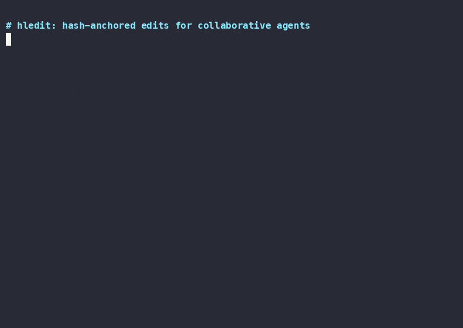

# hledit

`hledit` is a tiny hash-anchored line editor for AI coding agents.

Instead of asking an agent to reproduce old text exactly, `hledit read` annotates each line with a stable anchor:

```text
5#aB3:func main() {
6#xY7:    fmt.Println("hello")
7#Qw_:}
```

Write commands reference anchors such as `6#xY7`. Before changing the file, `hledit` recomputes the hash at that line. If the file changed since it was read, the anchor is rejected and no write happens.

## Why

Traditional text-matching edits fail silently when a file shifts between read and write. `hledit` fails loud on stale anchors so agents patch the right line or stop.

Built for AI coding agents: small local tools, typed inputs, deterministic text output, bounded context, and explicit failure modes.

## Demo



Recorded terminal demo source: [`docs/demo/hledit.cast`](docs/demo/hledit.cast)

Play locally:

```bash
asciinema play docs/demo/hledit.cast
```

The demo shows:

- `hledit read` producing `LN#ANCHOR` references
- another actor changing the target line
- stale edit rejection with `{"ok":false,"error":"stale"}`
- re-read with fresh anchor
- successful edit after anchor refresh

## Install

`hledit` is a standalone CLI. You do not need Pi or the bundled extension to use it.

## Requirements

- Go 1.21+
- A POSIX-like shell for the examples
- Pi is optional; only needed for the extension in [`../pi-hledit-diff`](../pi-hledit-diff/)

### Option 1: install with Go

```bash
go install github.com/Qihuanxishini/hledit-toolkit/cli@latest
```

Go installs the binary into `$GOBIN`, or `$GOPATH/bin` when `GOBIN` is unset. For a default Go setup, that is usually:

```text
$HOME/go/bin/hledit
```

Recommended: add Go's bin directory to your shell `PATH`:

```bash
export PATH="$HOME/go/bin:$PATH"
hledit --version
```

To make that persistent, add it to your shell startup file, for example:

```bash
# zsh (macOS default)
echo 'export PATH="$HOME/go/bin:$PATH"' >> ~/.zshrc

# bash
echo 'export PATH="$HOME/go/bin:$PATH"' >> ~/.bashrc
```

Optional: if an integration specifically looks in `~/.local/bin`, create a compatibility symlink. The `mkdir -p` line is only there to create the directory if it does not already exist:

```bash
mkdir -p "$HOME/.local/bin"
ln -sf "$HOME/go/bin/hledit" "$HOME/.local/bin/hledit"
```

You do not need the symlink for normal CLI use when `$HOME/go/bin` is on `PATH`.

### Option 2: build from source

For local development, build into `dist/` and symlink into `~/.local/bin`:

```bash
make install
```

Override the target bin directory if needed:

```bash
make install LOCAL_BIN="$HOME/bin"
```

Build without installing:

```bash
make build
# writes dist/hledit
```

## Development

```bash
go test ./...
go vet ./...
make check
```

## Optional Pi integration

This monorepo includes the [`pi-hledit-diff`](../pi-hledit-diff/) extension. It bundles this CLI and exposes two strict tools:

- `hledit_read_anchors`
- `hledit_apply_file_changes`

The extension requires `anchorProtocolV2:true`, `readRangeMetadata:true`, `batchInsertAfter:true`, `batchCheck:true`, `batchUpdatedAnchors:true`, and `batchStaleContext:true`. It consumes structured JSON reads and does not use the legacy single-tool `op` protocol or a post-edit `read-range` fallback.

After installing the extension in Pi, reload it:

```text
/reload
```

## Optional MCP integration

The MCP server is a separate package: [`hledit-mcp`](https://github.com/dabito/hledit-mcp). It wraps this CLI for MCP-compatible clients such as Claude Code, Claude Desktop, and Cursor.

Install after installing the CLI:

```bash
claude mcp add hledit npx hledit-mcp
```

## Commands

```text
hledit capabilities
hledit read <file> [--grep pattern] [--context N] [--json] [--pretty]
hledit read-range <file> [--offset N] [--limit M] [--grep pattern] [--context N] [--json] [--pretty]
hledit anchors <file> [--offset N] [--limit M] [--grep pattern] [--context N] [--json] [--pretty]
hledit replace <file> <anchor> <content-source>
hledit replace-range <file> <anchor> <end-anchor> <content-source>
hledit insert [--before|--after] <file> <anchor> <content-source>
hledit batch [--check] <file>
```

`--grep` matches substrings. `--context N` adds N lines before/after each match. `--pretty` adds ANSI styling for human reading; `--json` stays machine-readable and unstyled.
`<content-source>` is either `-` for stdin or a file path.

`hledit capabilities` emits machine-readable JSON for integrations. This tree reports `anchorProtocolV2:true`, `readRangeMetadata:true`, `batchInsertAfter:true`, `batchCheck:true`, `batchUpdatedAnchors:true`, and `batchStaleContext:true`; structured-read and patched-batch clients should require every field.

## Examples

Read a file:

```bash
hledit read main.go
```

Read a window of a large file:

```bash
hledit read-range main.go --offset 40 --limit 20
```

Read styled output for humans:

```bash
hledit read main.go --pretty
```

Replace one line using stdin:

```bash
printf '    fmt.Println("hello world")\n' | hledit replace main.go 6#xY7 -
```

Replace a range using a prepared file:

```bash
hledit replace-range main.go 12#aB3 18#xY7 /tmp/new-block.txt
```

Insert before or after an anchor:

```bash
cat header.txt | hledit insert --before main.go 1#Qw_ -
printf '// done\n' | hledit insert --after main.go 99#nK2 -
```
Apply multiple edits atomically with JSON on stdin:

```bash
printf '%s\n' '{"edits":[{"op":"replace","pos":"12#aB3","end_pos":"18#xY7","lines":["new block"]},{"op":"insert","pos":"22#Qw_","after":true,"lines":["// inserted"]}]}' | hledit batch main.go
echo '{"edits":[{"op":"replace","pos":"12#aB3","lines":["fixed"]}]}' | hledit batch --check main.go
```

Batch `insert` places lines before its anchor by default. Set `"after": true` to place them after it.
Delete a line or range by piping empty stdin and using `-` as the content source:

```bash
printf '' | hledit replace main.go 6#xY7 -
printf '' | hledit replace-range main.go 12#aB3 18#xY7 -
```

## Output

Read emits `LN#HHH:TEXT`; anchors emits `ANCHOR<TAB>TEXT`.
`--json` emits `{ok, totalLines, lines:[{line,anchor,text,textTruncated?}], truncated, nextOffset?}`; an offset past EOF returns `requestedOffset` and `totalLines`.

```text
1#aB3:package main
2#xY7:
3#Qw_:import "fmt"
```

Write commands emit JSON:

```json
{"ok":true,"contentChanged":true,"firstChangedLine":6,"lastChangedLine":6}
```

Batch adds `editsApplied`. A successful write also returns a bounded `updatedAnchors` window; `--check` instead adds `checked:true` and does not write. If validated replacement content is already present, `contentChanged:false` is returned and the target is not touched.

```json
{
  "ok": true,
  "contentChanged": true,
  "firstChangedLine": 2,
  "lastChangedLine": 4,
  "editsApplied": 2,
  "updatedAnchors": {
    "lines": [{"line":2,"anchor":"2#aB3","text":"updated"}],
    "offset": 2,
    "limit": 1,
    "desiredLimit": 1,
    "truncated": false
  }
}
```

Stale anchors are rejected atomically:

```json
{
  "ok": false,
  "error": "stale",
  "message": "anchor 6#xY7: stale",
  "remaps": [{"requested":"6#xY7","current":"6#xY8"}],
  "currentAnchors": {
    "lines": [{"line":6,"anchor":"6#xY8","text":"current line"}],
    "offset": 4, "limit": 5, "desiredLimit": 5, "truncated": false
  }
}
```

## Hash format

Anchors are `LN#HHH`:

- `LN` is the 1-indexed line number.
- `HHH` is a 3-character URL-safe Base64 content hash.
- The hash uses FNV-1a 32-bit, normalized trailing whitespace, and the alphabet `A-Z`, `a-z`, `0-9`, `-`, `_`; it encodes the low 18 hash bits.
- Blank or punctuation-only lines mix the line number into the hash so identical structural lines are easier for models to distinguish.

## Behavior notes

- Writes resolve symlink targets, use unique temporary siblings, preserve existing permission bits, and atomically replace the real target.
- All anchors in a write are validated before writing.
- Input must be valid UTF-8; an existing UTF-8 BOM is hidden from line text and preserved across writes.
- Batch JSON rejects unknown fields and trailing values so misspelled protocol fields cannot silently change edit semantics.
- Files with multiple hard links are rejected rather than silently breaking link identity or weakening atomicity.
- Validated no-op replacements return `contentChanged:false` without touching the filesystem.
- Batch insert supports `"after": true`; insert and replace/delete operations may not target the same anchor or range.
- Logical failures (`stale`, `invalid`, `binary`, `encoding`, `range`, `io`) are reported as JSON on stdout.
- CLI misuse exits `2`; unrecoverable infrastructure failures exit `1`; normal logical outcomes exit `0`.

## Failure modes

- stale anchor -> inspect `currentAnchors`; only explicitly retry when its complete window still covers the intended target and range, otherwise re-read the affected range
- binary file -> stop and use a text file
- invalid UTF-8 -> convert the file explicitly before editing; hledit will not rewrite undecodable bytes
- invalid anchor or CLI misuse -> fix args
- I/O error -> check path and permissions
- hard-link rejection -> choose a regular single-link target; hledit will not pick between atomicity and shared-inode updates
- text `read` output may append a truncation sentinel; use `--json` for machine parsing

## When not to use it

- binary files
- minified or positional-only edits where anchors add no value
- workflows that need fuzzy matching instead of stale-safe rejection

## Credits and prior art

The core hashline-edit idea comes from Can Bölük / @can1357's work on coding-agent harnesses, especially [“I Improved 15 LLMs at Coding in One Afternoon. Only the Harness Changed.”](https://blog.can.ac/2026/02/12/the-harness-problem/) and [`oh-my-pi`](https://github.com/can1357/oh-my-pi). Read that article for the deeper technical rationale and benchmark discussion.

This version is maintained in the [`hledit-toolkit`](https://github.com/Qihuanxishini/hledit-toolkit) monorepo and is derived from [`dabito/hledit`](https://github.com/dabito/hledit). Its scope remains intentionally narrow:

- standalone stdlib Go CLI, not a full agent harness;
- stable JSON outputs for agent/tool integration;
- deterministic stale-checking edits with no fuzzy matching;
- Pi integration provided by [`pi-hledit-diff`](../pi-hledit-diff/).

Additional prior art: [`aron/hashline`](https://github.com/aron/hashline), a reference Go implementation/spec for hash-anchored line editing.

## Project docs

- [`PRD.md`](./PRD.md) — product requirements
- [`SPEC.md`](./SPEC.md) — implementation contract
